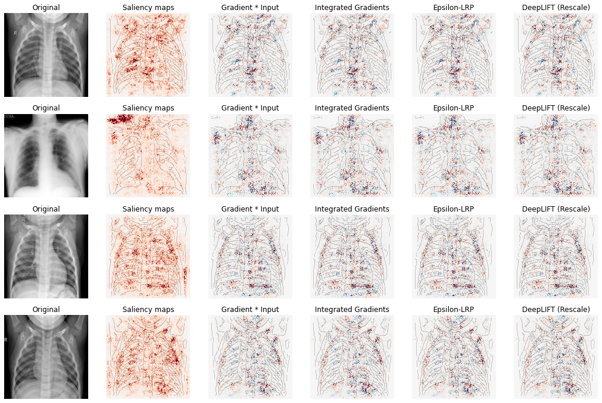

# Visualização de Dados em Deep Learning (XAI)

Este repositório contém o trabalho de Iniciação Científica sobre a aplicação de **Deep Learning (DL)** e **Inteligência Artificial Explicável (XAI)** na classificação de imagens médicas, focando em **COVID-19**, **Pneumonia Viral** e **Pulmão Normal**.

---

## 1. Resumo

Áreas como **Machine Learning (ML)** e **Deep Learning (DL)** lidam com grandes volumes de dados, como análise de dígitos e imagens médicas. Algumas redes neurais convolucionais (CNNs) possuem muitas camadas ocultas, resultando no problema da "caixa-preta", onde a saída da rede é conhecida, mas não se sabe como ela chegou a ela.  

O estudo utiliza técnicas de **XAI** para alterar gradientes específicos do conjunto de dados, buscando melhorar a interpretabilidade e a confiabilidade do modelo. Durante a pandemia de COVID-19, a classificação de imagens de radiografias/tomografias de tórax surge como alternativa para detecção do vírus.

> **Palavras-chave:** IA, CNN, XAI, COVID-19, Pneumonia Viral

---

## 2. Materiais e Métodos

- **Tipo de estudo:** Bibliográfico, explicativo e exploratório  
- **Plataforma:** Google Colaboratory (com GPU/TPU virtual)  
- **Dataset:**  
  - Coletado no Kaggle por pesquisadores e médicos de universidades do Qatar, Dhaka, Doha, Bangladesh, Paquistão e Malásia  
  - Fontes adicionais: SIRM COVID-19 DATABASE, Novel Corona Virus 2019 Dataset (GitHub de Joseph Paul Cohen e colaboradores) e 43 publicações  
  - Total: 3.616 imagens COVID-19, 10.192 pulmão normal, 6.012 opacidade pulmonar, 1.345 pneumonia viral  
  - Selecionadas para estudo: 1.389 imagens redimensionadas para 299x299 px  
  - Conjunto de treino: 700 imagens (200 COVID, 250 Pneumonia Viral, 250 Normal)  
  - Conjunto de teste: 689 imagens (89 COVID, 300 Pneumonia Viral, 300 Normal)  

- **Modelagem:**  
  - **Arquitetura:** CNN Keras com camadas Conv2D, MaxPooling, Dropout e BatchNormalization  
  - **Técnicas XAI:** DeepExplain (DeepLIFT, LRP, Gradient * Input, Integrated Gradients, Saliency Maps)  
  - **Objetivo:** Avaliar o impacto das técnicas de XAI na classificação das imagens  

---

## 3. Resultados e Discussão

### Tabela de acurácias por técnica

| Classe / Técnica | Original | LRP | Gradient * Input | Saliency Maps | Integrated Gradients | DeepLIFT |
|-----------------|---------|-----|----------------|---------------|--------------------|---------|
| **Acurácia geral** | 85.63% | 33.96% | 60.96% | 52.10% | 77.94% | 51.96% |
| **Normal** | 80.00% | 23.67% | 46.67% | 23.67% | 64.67% | 0.00% |
| **COVID-19** | 73.03% | 94.38% | 2.25% | 95.51% | 85.39% | 94.38% |
| **Viral** | 95.00% | 26.33% | 92.67% | 67.67% | 89.00% | 91.33% |

> Fonte: Autor

**Observações:**
- Algumas técnicas superam a acurácia do modelo original em classes específicas  
- **Integrated Gradients** apresenta melhor equilíbrio geral entre as classes  
- Cada técnica teve desempenho superior em pelo menos uma classe  

---

## 4. Conclusões

- Não houve melhoria significativa na acurácia geral da rede, mas técnicas XAI se mostraram úteis em classes específicas  
- Fatores que podem ter influenciado os resultados:
  - Desequilíbrio entre classes no dataset  
  - Teste em uma única arquitetura  
  - Dificuldades de aprendizado do modelo (ex.: DeepLIFT falhou em prever pulmão normal)  
- Pesquisas futuras:
  - Processamento adicional das imagens alteradas para aumentar qualidade  
  - Testes em múltiplas arquiteturas  
  - Ajustes de pré-processamento e balanceamento do dataset  

---

## 5. Exemplos de Saídas XAI

